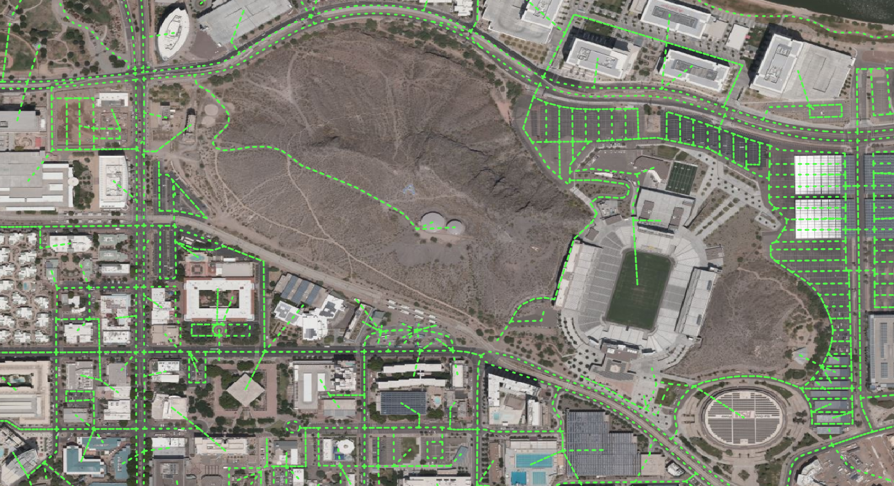

# GTFS2GMNS

The [General Transit Feed Specification (GTFS)](https://gtfs.org/) defines a
common format for public transportation schedules and associated geographic
information. It is used by thousands of public transport providers. As a data
conversion tool, gtfs2gmns, can directly convert the GTFS data to node, link,
and agent files in the [GMNS](https://github.com/zephyr-data-specs/GMNS) format.

Take the [ASU Tempe
network](https://github.com/xtHuang0927/GTFS2GMNS/tree/main/data) as an example.
You can visualize generated networks using
[NeXTA](https://github.com/xzhou99/NeXTA-GMNS) or
[QGIS](https://qgis.org/en/site/).

**Obtain walk+bike mobility network**

You only need the following 4 lines of python codes

| import osm2gmns as og net = og.getNetFromOSMFile(r'Tempe.osm', network_type=('walk'),\\  POIs=True,default_lanes=True,default_speed=True) og.connectPOIWithNet(net) og.outputNetToCSV(net)  |
|---------------------------------------------------------------------------------------------------------------------------------------------------------------------------------------------|

Walk mobility network at ASU (red)

Bike mobility at ASU (green)

Walk+Bike (red+green)

